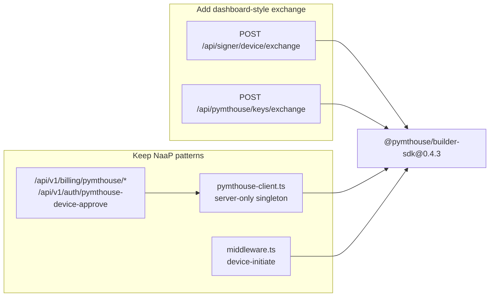
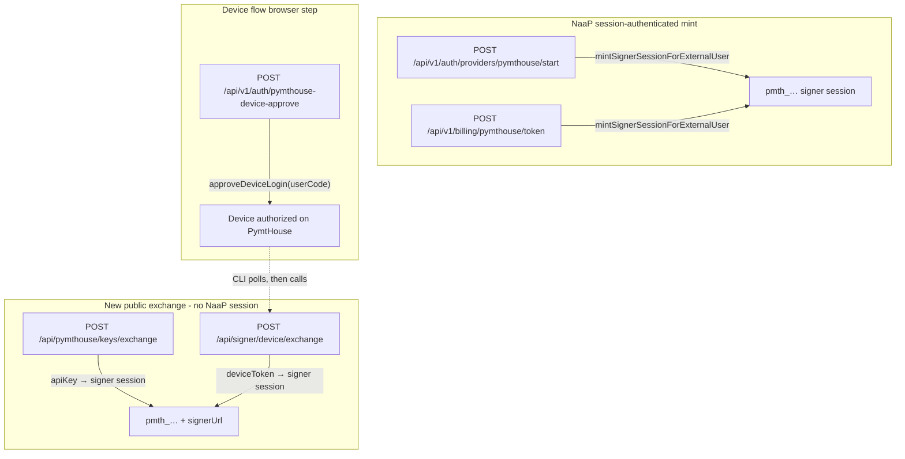

# NaaP `@pymthouse/builder-sdk` 0.4.3 upgrade

## Goal

Upgrade NaaP to **`@pymthouse/builder-sdk@0.4.3`** (exact npm pin, same as [dashboard/package.json](file:///home/elite/repos/dashboard/package.json)), preserve NaaP's integration architecture, and add the two **public** signer-token exchange routes PymtHouse clients expect—**no signer proxy**.

---

## Phase 1 — Dependency bump (mechanical)

Update exact pins in all three workspace consumers:

| File | Current | Target |
|------|---------|--------|
| [apps/web-next/package.json](file:///home/elite/repos/naap/apps/web-next/package.json) | `0.1.0` | `0.4.3` |
| [plugins/developer-api/backend/package.json](file:///home/elite/repos/naap/plugins/developer-api/backend/package.json) | `0.1.0` | `0.4.3` |
| [plugins/developer-api/frontend/package.json](file:///home/elite/repos/naap/plugins/developer-api/frontend/package.json) | `0.1.0` | `0.4.3` |

Then run `npm install` at repo root to regenerate [package-lock.json](file:///home/elite/repos/naap/package-lock.json).

**No Next.js bundler changes expected** — NaaP already documents that the SDK ships precompiled `dist/*.js` ([apps/web-next/next.config.js](file:///home/elite/repos/naap/apps/web-next/next.config.js)); keep `vitest` `deps.inline` for `@pymthouse/builder-sdk` and `oauth4webapi`.

---

## Phase 2 — Add exchange routes (dashboard pattern, no proxy)

Add thin route wrappers using SDK handler factories from `@pymthouse/builder-sdk/signer/server` (same pattern as [dashboard/app/api/signer/device/exchange/route.ts](file:///home/elite/repos/dashboard/app/api/signer/device/exchange/route.ts) and [dashboard/app/api/pymthouse/keys/exchange/route.ts](file:///home/elite/repos/dashboard/app/api/pymthouse/keys/exchange/route.ts)).

**Intentionally outside `/api/v1`** — these paths match PymtHouse/dashboard client expectations and pymthouse app registration URLs.

### New files

1. **`apps/web-next/src/lib/pymthouse-signer-exchange-config.ts`** (shared, `import 'server-only'`)
   - Centralize env-derived config (dashboard duplicates this in both route files — avoid that in NaaP).
   - Read: `PYMTHOUSE_ISSUER_URL`, `PYMTHOUSE_PUBLIC_CLIENT_ID`, `PYMTHOUSE_M2M_CLIENT_ID`, `PYMTHOUSE_M2M_CLIENT_SECRET`, `PYMTHOUSE_SIGNER_URL` (fallback: derive `{issuerOrigin}/api/signer`), `PYMTHOUSE_ALLOW_INSECURE_HTTP=1`.
   - Export `readDeviceExchangeConfig()` and `readApiKeyExchangeConfig()` returning `null` when incomplete (routes return 503 JSON like dashboard).

2. **`apps/web-next/src/app/api/signer/device/exchange/route.ts`**
   - `POST` only → `createDeviceExchangeHandler(config)`.
   - Accepts `{ deviceToken, scope?, clientId? }`; returns signer session + optional `signerUrl`.

3. **`apps/web-next/src/app/api/pymthouse/keys/exchange/route.ts`**
   - `POST` only → `createApiKeyExchangeHandler(config)`.
   - Accepts `{ apiKey, scope?, clientId? }`; returns signer session + optional `signerUrl`.

Both routes: `export const runtime = 'nodejs'`, `dynamic = 'force-dynamic'`, no NaaP session/CSRF (public machine-to-machine exchange surface, same as dashboard).

### Env / docs

Add to [apps/web-next/.env.local.example](file:///home/elite/repos/naap/apps/web-next/.env.local.example) and [docs/pymthouse-integration.md](file:///home/elite/repos/naap/docs/pymthouse-integration.md):

- `PYMTHOUSE_SIGNER_URL` — upstream signer facade URL returned in exchange responses (e.g. `http://localhost:3001/api/signer`)
- `PYMTHOUSE_ALLOW_INSECURE_HTTP=1` — local `http://` issuers (dashboard pattern; complements SDK's auto-detect in `createPmtHouseClientFromEnv`)

Update docs pin from `0.1.0` → `0.4.3` and document the two new exchange endpoints.

---

## Phase 3 — Keep NaaP patterns (do not port from dashboard)

| NaaP pattern (keep) | Dashboard alternative (skip) |
|---------------------|------------------------------|
| [pymthouse-client.ts](file:///home/elite/repos/naap/apps/web-next/src/lib/pymthouse-client.ts) `createPmtHouseClientFromEnv()` singleton | Manual `new PmtHouseClient({...})` per call |
| Device initiate in [middleware.ts](file:///home/elite/repos/naap/apps/web-next/src/middleware.ts) + signed cookie | Dedicated `GET /api/auth/initiate-login` route |
| `approveDeviceLogin()` in device-approve route | Manual `upsertAppUser` + `mintUserAccessToken` + `completeDeviceApproval` |
| `/api/v1/*` BFF envelope (`success`/`errors`) | Flat JSON error shapes |
| Hardcoded / env-driven **upstream** signer URL in DeveloperView python-gateway bundle | Signer proxy at `/api/signer/[...path]` |

**Do not add** signer proxy (`forwardSignerProxyRequest`) or dashboard account-usage BFF refactor.

---

## Phase 4 — Minor 0.4.x alignment (optional, low risk)

In [usage/route.ts](file:///home/elite/repos/naap/apps/web-next/src/app/api/v1/billing/pymthouse/usage/route.ts), pass `includeRetail: true` to `fetchUsageForExternalUser` (available since 0.4.2; dashboard uses it). Response may gain `dailyByPipeline` — additive, existing `stripCryptoUnitFields` still applies.

Fix stale doc reference: [docs/pymthouse-integration.md](file:///home/elite/repos/naap/docs/pymthouse-integration.md) line 155 says `completeDeviceApproval` but code uses `approveDeviceLogin()` (higher-level SDK method, correct for 0.4.3).

---

## Compatibility with builder-sdk 0.4.3

### Safe — no import migration required

All subpaths NaaP uses today exist unchanged in 0.4.3:

- `@pymthouse/builder-sdk` — `PmtHouseClient`, `PmtHouseError`, `toPmtHouseError`, usage helpers
- `@pymthouse/builder-sdk/config` — `isPymthouseConfigured`, `readPymthouseEnv`, device-initiate helpers
- `@pymthouse/builder-sdk/env` — `createPmtHouseClientFromEnv` (server-only)
- `@pymthouse/builder-sdk/tokens` — `computeSignerSessionExpiry`, `SIGNER_SESSION_TTL_MS`, etc.
- `@pymthouse/builder-sdk/device-initiate` — validation helpers

### New capability used by this plan

- `@pymthouse/builder-sdk/signer/server` — `createDeviceExchangeHandler`, `createApiKeyExchangeHandler` (added in 0.3.x–0.4.x)

### Breaking changes in 0.4.x — NaaP impact

| Change | NaaP impact |
|--------|-------------|
| Gateway surface removed (`@pymthouse/builder-sdk/gateway*`) | **None** — never imported |
| Sync proxy metering removed | **None** — never used |
| Signer token manager requires `publicClientId` | **None** — only relevant if adopting signer proxy / direct DMZ proxy |
| Token exchange default audience → OIDC issuer URL (0.4.2) | **Benefit** — `approveDeviceLogin` and new exchange handlers get fix automatically |
| `fetchUsageForExternalUser({ includeRetail })` | **Additive** — opt-in in Phase 4 |

### Not in 0.4.3 (present in local builder-sdk 0.6.0)

`auth0/management`, `billing/openmeter`, `signer/webhook/adapters/auth0` — do not adopt unless explicitly needed later.

---

## Duplication / overlapping functional paths

Understanding what already exists vs what the new routes add:

| Path | Auth | SDK entry | Overlap? |
|------|------|-----------|----------|
| `POST /api/v1/auth/providers/pymthouse/start` | NaaP session + CSRF | `mintSignerSessionForExternalUser` | **Duplicates mint logic** with token route; also writes `BillingProviderOAuthSession` audit row |
| `POST /api/v1/billing/pymthouse/token` | NaaP session + CSRF | `mintSignerSessionForExternalUser` | Same mint as start; **re-mint on demand** for Developer UI |
| `POST /api/pymthouse/keys/exchange` *(new)* | PymtHouse API key in body | `createApiKeyExchangeHandler` → `exchangeApiKeyForSignerSession` | **Different caller** — external tools with existing `pmth_`/`app_` keys, no NaaP login. Documented in dashboard KeysView for python-gateway |
| `POST /api/signer/device/exchange` *(new)* | Device token in body | `createDeviceExchangeHandler` | **Complements** device-approve (browser consent); CLI step after RFC 8628 polling |
| `POST /api/v1/auth/pymthouse-device-approve` | NaaP session + CSRF | `approveDeviceLogin` | **Not duplicate** of device/exchange — human approval vs token exchange |
| `GET /api/v1/billing/pymthouse/usage` | NaaP session | `fetchUsageForExternalUser` / `getUsage` | Dashboard's `/api/pymthouse/account-usage` is a **different shape** (balance strip, rolling period, prior period). NaaP returns raw SDK payload — intentional, keep as-is |
| `POST /api/v1/developer/keys` | NaaP session | Stores user-supplied `rawApiKey` in DB | **Not an exchange** — persistence layer; pymthouse keys come from provider/start mint, not keys/exchange |
| DeveloperView python-gateway bundle | Browser | Hardcoded `https://pymthouse.com/api/signer` | Points at **upstream PymtHouse signer** (correct without proxy). Exchange routes return `signerUrl` for clients that call them directly |

**Recommended post-upgrade note (no code change required):** `start` and `token` both call `mintSignerSessionForExternalUser` — acceptable duplication today (different audit/rate-limit semantics). Do not consolidate unless refactoring billing auth.

---

## Verification checklist

1. `npm install` + `npm run typecheck -w @naap/web-next`
2. Unit tests: `usage/route.test.ts`, `pymthouse-manifest.test.ts`, `pymthouse-device-initiate.test.ts`
3. **Existing flows** (session-authenticated):
   - `POST /api/v1/auth/providers/pymthouse/start` → `pmth_…` token
   - `POST /api/v1/billing/pymthouse/token` → re-mint
   - `GET /api/v1/billing/pymthouse/usage?scope=me`
   - Device flow: middleware initiate → login → `POST /api/v1/auth/pymthouse-device-approve`
4. **New exchange routes** (with local pymthouse):
   - `POST /api/pymthouse/keys/exchange` with valid API key body
   - `POST /api/signer/device/exchange` with valid device token (after device approval + CLI poll)
5. `apps/web-next` production build

---

## Out of scope

- Signer proxy (`/api/signer/[...path]`)
- Dashboard account-usage BFF (`fetchAccountUsageForExternalUser`, balance strip, rolling charts)
- Dashboard raw-fetch keys BFF (`pymthouse-keys-bff.ts`) — NaaP uses Prisma `devApiKey` model instead
- Refactoring `start`/`token` mint duplication
- Bumping beyond 0.4.3 to local 0.6.0 features
