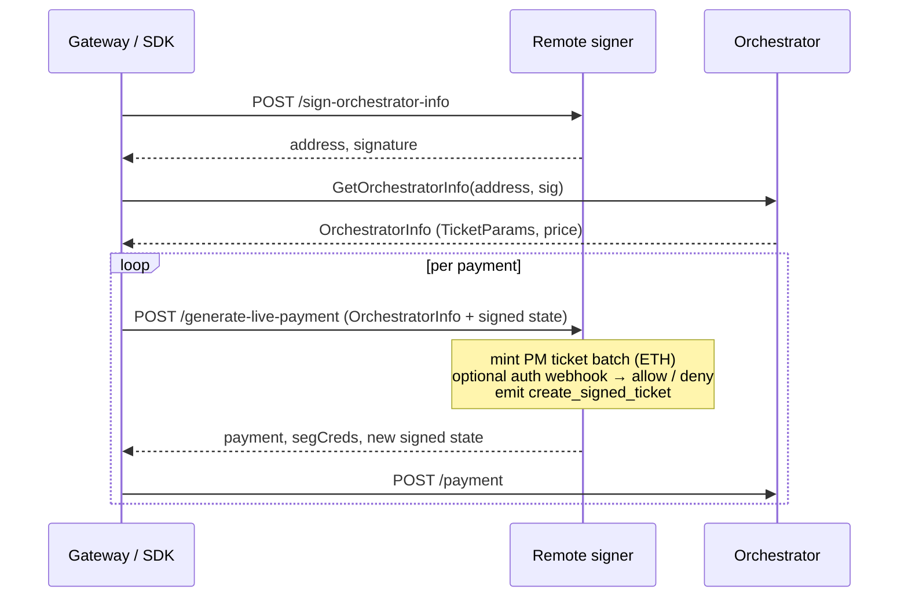
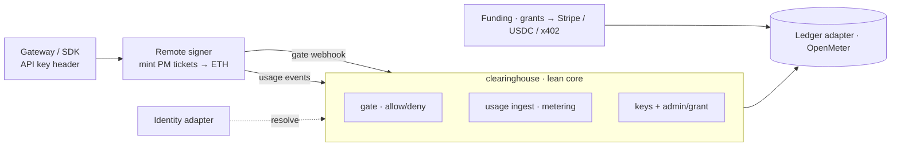

> **Source doc — Tier 2 (Payment Provider role).** Written to split into the official Mintlify docs as a new operator role beside Orchestrator / Gateway / Delegator. The consume side (running a job, attaching a key) lives in **[Run a job on the network](./run-a-job.md)**.
>
> **Status legend:** *Shipped* — in go-livepeer today. *In build* — designed, not yet shipped (`livepeer/clearinghouse` is a scaffold; items marked *in build* are placeholders to finalize at build time).

## Payments on Livepeer

Livepeer is a decentralized network: every job is paid by sending the orchestrator a **probabilistic-micropayment (PM) ticket** that settles on-chain in ETH. A **signer** holds the wallet and mints those tickets behind a plain HTTP endpoint — so your app pays with just a URL and a header, no wallet or crypto in your code.

Because the signer is a **separate node**, a local SDK can run jobs and pay orchestrators directly — no gateway in the path. Anything beyond raw payment — identity, balances, currency, billing — is added by a **clearinghouse** that sits *beside* the signer, never inside it. So there are two components, and you can stop at the first:

- **Remote signer** — mints the PM tickets that pay orchestrators. *(Shipped.)*
- **Clearinghouse** — the optional accounting layer on top: identity, balances, a spending gate, metering, funding. *(In build.)*

## Choose how you pay

By how much you want to operate yourself:

| Path | You run | Use when |
|---|---|---|
| **[Use a hosted signer](#use-a-hosted-signer)** | nothing | you just want a key — someone else runs the infrastructure |
| **[Run a remote signer](#run-a-remote-signer)** | a signer node | you pay for *your own* jobs from a trusted network — no accounts needed |
| **[Run the clearinghouse suite](#run-the-clearinghouse-suite)** | signer + accounting | you serve *other* customers: identity, balances, metering, billing |

## Use a hosted signer

A hosted signer is a **managed clearinghouse** — someone else runs the signer, the accounting, and the funding rails, and gives you a key. Crucially, they bill you in **fiat** (cards, credits, dollars), so you never touch crypto, hold a wallet, or manage ETH. For your app it's the [signer step in Run a job](./run-a-job.md#4-pay-for-the-job-the-signer-step): sign up, top up, and pass `signer_url` + `signer_headers`.

[PymtHouse](https://pymthouse.com) is a community-hosted option — billing, identity, payments, a UI, multi-cloud deploy — already onboarding apps, and more will follow. Each clearinghouse run *for the network* is an SPE governance proposal built on the same lean core described below.

## Run a remote signer

The signer is a standalone go-livepeer node (`-remoteSigner`) that holds the Ethereum key and signs PM tickets on demand, keeping the key out of the untrusted media path. It is **stateless**: it mints tickets, optionally asks a webhook "ok?", and tracks no customers or balances.



**Run it right next to your app.** With no webhook configured (`-remoteSignerWebhookUrl` unset), a signer is a complete, self-contained way to pay for *your own* jobs — put it on the same private network as the SDK that requests jobs and you need no clearinghouse, no auth, no gate:

```bash
livepeer -remoteSigner -network arbitrum-one-mainnet -ethUrl <rpc> \
  -ethKeystorePath <path> -maxPricePerUnit <wei> -httpAddr 0.0.0.0:8935
```

Every `/generate-live-payment` request is then allowed and signed from the signer's own wallet. The only guardrails are pricing caps and a hard ≤100 tickets-per-request cap — there is **no per-caller auth, spend cap, or rate limit**. So:

- **Safe for self-use** — your app and your signer in one trust domain, paying for your jobs. No attach key, no gate.
- **Never expose it** — anyone who can reach it can drain your wallet. Keep it internal behind infrastructure controls; being stateless, run it redundantly behind round-robin DNS.

The moment you want *others* to call it, point it at a webhook — that's the clearinghouse.

Key properties:

- **Needs an on-chain network** (ETH connectivity to manage tickets). Your SDK stays offchain — it only needs the signer URL and a header.
- **Stateless via a signed state blob.** Each response returns a blob the caller stores and sends back next time; the signer signs and verifies it, so no shared DB is needed.
- **Pricing is enforced on the signer** (`-maxPricePerUnit`, max ticket EV).
- **Key custody.** For production, delegate signing to the [`external-signer`](https://github.com/livepeer/external-signer) sidecar (Web3Signer → Turnkey / Fireblocks / Privy / Dfns) so the key never leaves your custody provider: `livepeer -remoteSigner -ethExternalSigner http://127.0.0.1:8550`.

## Run the clearinghouse suite

The clearinghouse **suite** is our payment logic packaged to run inside *your* app or infrastructure — so you can serve *other* customers without building accounting from scratch. It turns "mint a ticket" into "draw down this customer's balance," and integrates with established auth, metering, billing, and fiat-payment systems rather than reinventing them. It runs on an **unmodified** signer, plugging into three touchpoints the signer already exposes. *(In build.)*

| Touchpoint | Direction | Purpose |
|---|---|---|
| **Auth webhook** (`-remoteSignerWebhookUrl`) | signer → clearinghouse | the gate — allow/deny per payment |
| **Request headers** (`-remoteSignerHeaders`) | gateway → signer → webhook | customer identity (e.g. an API key) |
| **`create_signed_ticket` events** | signer → bus (Kafka) | usage metering (fee in wei, pixels, `num_tickets`, `manifest_id`) |

It is built on **ports & adapters** — a stable interface (*port*) with swappable implementations (*adapter*) — so you integrate proven tools instead of hand-rolling auth, metering, or billing:

| Concern | Port | Available (v1) | Planned (drop-in) |
|---|---|---|---|
| Identity | `IdentityResolver` | API key | OIDC / OAuth |
| Metering + billing | `Ledger` | OpenMeter | Lago, Kill Bill |
| Funding | `FundingRail` | Grants (operator-issued) | Stripe, USDC, x402 |



The core does two things:

- **Gate** — answer the signer's auth webhook: resolve the customer from the header, check their balance, allow or deny. A rejection means no usable payment, so it's a **pre-spend** gate.
- **Meter** — consume `create_signed_ticket` events and draw the balance down. **Idempotent** (dedupe on `request_id`/`sequence_number`) and **gap-tolerant** (reconstruct missed events — exactly-once delivery isn't guaranteed).

Keep **usage** and **balance** as separate ledgers with an explicit reconciliation step. Bill on minted-ticket EV (the signer reports fees in wei); use the wallet's on-chain ETH spend only as a later *aggregate* cross-check, not a per-customer match (PM is probabilistic).

**Funding starts with grants** — an operator issues a customer a trial budget, the operator's wallet carries the ETH cost; real on-ramps (Stripe / USDC / x402) plug in later behind the `FundingRail` port. **Auth** is a personal API key for v1; OIDC/OAuth comes later via the `IdentityResolver` adapter.

```bash
docker compose up   # in build: signer + clearinghouse + OpenMeter
```

**Acceptance loop:** grant → run a job → balance draws down → signing hard-stops at $0.

**Design principles:** minimal first · never fork the signer (external, stable contract) · ports & adapters · delegate accounting to a proven engine · accounting first, on-ramps later · no auth platform in the core.

> **In build:** concrete API-key/grant/admin endpoints, config keys, and the compose file land here once `livepeer/clearinghouse` ships them.

---

## Reference

### Signer flags (go-livepeer)

| Flag | Mode | Purpose |
|---|---|---|
| `-remoteSigner` | signer | run the remote signer service (requires an on-chain network) |
| `-remoteSignerUrl` | gateway | URL of the signer to attach to |
| `-remoteSignerHeaders` | gateway | headers sent gateway → signer, e.g. `header:val,header2:val2` (identity channel) |
| `-remoteSignerWebhookUrl` | signer | auth-webhook URL called during `/generate-live-payment` (the gate) |
| `-remoteSignerWebhookHeaders` | signer | headers sent on webhook requests |
| `-remoteDiscovery` | signer | enable orchestrator discovery via `/discover-orchestrators` |
| `-maxPricePerUnit` | signer | reject orchestrator prices above this (returns 481) |
| `-ethExternalSigner` | signer | delegate ETH signing to a Web3Signer sidecar (`external-signer`) |

### Endpoints & status codes

`POST /sign-orchestrator-info` · `POST /generate-live-payment` · `POST /sign-byoc-job` · `GET /discover-orchestrators`

`480` refresh session · `481` price exceeded · `482` no tickets needed.

### Auth webhook contract

Fired after the payment state is updated but **just before it is signed** — a rejection means no usable payment, making it a pre-spend gate.

```json
// request (signer → webhook)
{ "Headers": { "Authorization": ["Bearer <key>"] },
  "State": { "...": "RemotePaymentState — StateID, PMSessionID, OrchestratorAddress, Balance, ..." } }

// response (webhook → signer)
{ "Status": 200, "Reason": "", "Expiry": 1718630400 }
```

- `Status` — HTTP status returned to the caller; non-200 denies the payment.
- `Reason` — message when denied.
- `Expiry` — Unix seconds to cache this allow decision (signer skips the webhook while `AuthExpiry > now`); `0` = no caching.

### `create_signed_ticket` Kafka event

| Field | Meaning |
|---|---|
| `session_id`, `session_status` | opaque state ID; `new` / `continuing` |
| `pipeline` | e.g. `live-video-to-video` |
| `request_id` | per-request UUID (dedupe key) |
| `orch_address`, `orch_url` | orchestrator ETH address + service URL |
| `manifest_id`, `pm_session_id` | stream + PM session identifiers |
| `current_time(_unix)`, `previous_time(_unix)` | timing for usage measurement |
| `billable_secs`, `pixels` | usage measured |
| `computed_fee`, `cost_per_pixel`, `session_balance` | fee (wei), price ratio, balance after update |
| `sequence_number`, `num_tickets` | request count; tickets minted |

---

## Appendix: source material

- Vision: *Improve App Payment Experience* (Notion); Payments Clearinghouse / Livepeer: Weir.
- Signer code: `server/remote_signer.go`, `core/accounting.go`, `cmd/livepeer/starter/flags.go`; `doc/remote-signer.md`.
- Custody sidecar: [`livepeer/external-signer`](https://github.com/livepeer/external-signer).
- SDK: [`livepeer/livepeer-python-gateway`](https://github.com/livepeer/livepeer-python-gateway).
- Community hosted clearinghouse: [`eliteprox/pymthouse`](https://github.com/eliteprox/pymthouse).
- Forum: [Livepeer Payment Clearinghouse](https://forum.livepeer.org/t/livepeer-payment-clearinghouse/3264).
